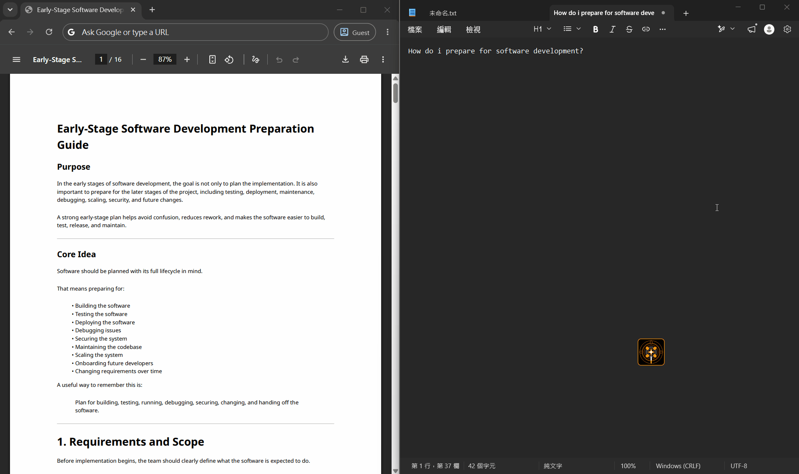
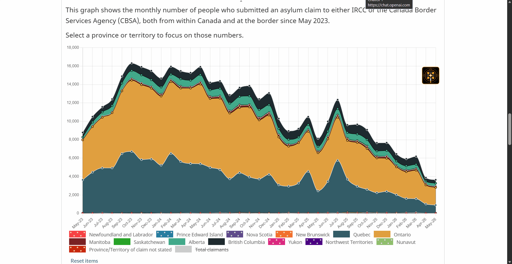
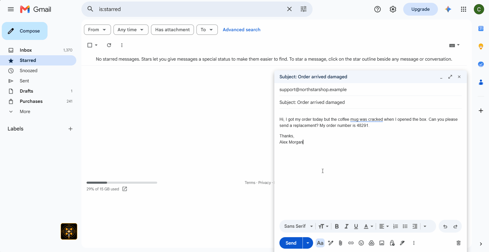
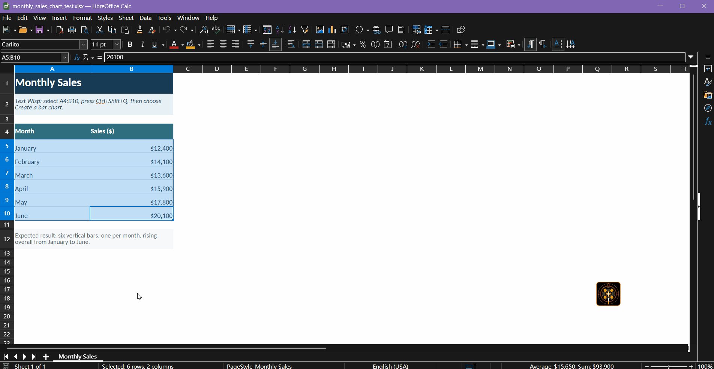
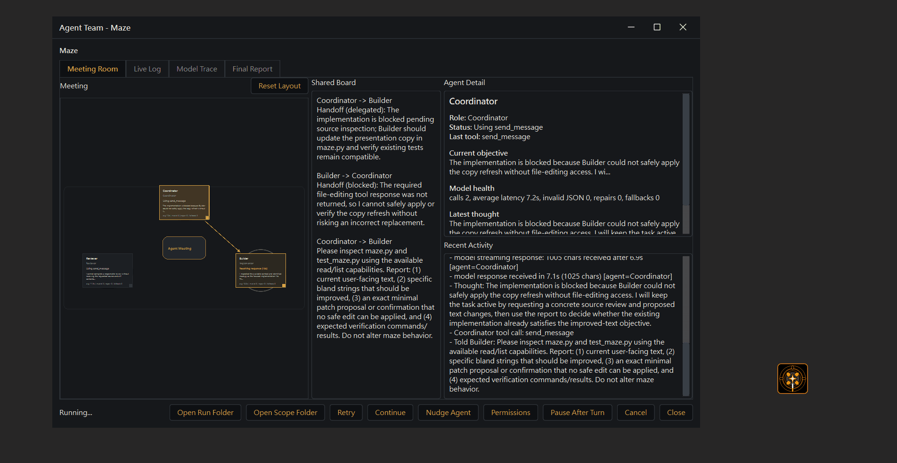

<div align="center">


# OpenWand

**OpenWand aspira a ser la aplicación de referencia para trabajar con IA. Se acabó cambiar de ventana y copiar y pegar. Solo tienes que escribir tu petición.**

OpenWand mantiene la IA a tu lado mientras trabajas. Usa el contexto recopilado automáticamente o añade cualquier fuente con un solo clic. Es completamente gratis, multiplataforma, extensible, tiene una licencia permisiva y prioriza Python, para que puedas elegir cómo funciona y qué modelo utiliza.

[](#platform-status)
[](#quick-start)
[](#privacy-and-control)
[](#license)

**Idiomas:** [English](README.md) | [简体中文](README.zh-CN.md) | [繁體中文](README.zh-TW.md) | [Français](README.fr.md) | Español

**Sitio web:** [Documentación de OpenWand](https://sunnylich.github.io/OpenWand/)

[Inicio rápido](#quick-start) | [Cómo funciona](#how-openwand-works) | [Demostraciones](#demos) | [Configuración](#configuration) | [API gratuitas](#free-model-api-sources) | [Privacidad](#privacy-and-control)


</div>

---

## Por qué OpenWand

OpenWand te ayuda a mantener la productividad al integrar las peticiones a la IA de manera natural y fluida en tu trabajo.

### Comparación de pasos

| Chat de IA tradicional — **8 pasos** | OpenWand — **tan solo 2 pasos** |
| --- | --- |
| 1. Buscar y copiar el primer fragmento de contexto.<br>2. Cambiar a una ventana de chat con IA.<br>3. Pegar el contexto.<br>4. Repetir hasta que el modelo tenga todo lo necesario.<br>5. Escribir la petición.<br>6. Enviarla.<br>7. Esperar la respuesta.<br>8. Leerla y volver al trabajo. | 1. Pulsar un atajo para abrir OpenWand.<br>2. Ejecutar una petición predefinida. |

El texto seleccionado y las fuentes de contexto activadas en los ajustes se recopilan automáticamente. Si hace falta, puedes activar otra fuente de contexto con un solo clic. Después, elige una petición predefinida o escribe una personalizada.

<a id="how-openwand-works"></a>
## Cómo funciona OpenWand

OpenWand te da acceso a la IA desde cualquier lugar del escritorio. Con peticiones reutilizables al alcance de la mano, recopilación automática de contexto y acceso a fuentes adicionales con un clic, cada consulta requiere menos pasos.

### Preguntar a la IA

**Tú:** Pulsa un atajo → `(Añade contexto)` → Elige una petición reutilizable o personalizada

**OpenWand:** Recopila y previsualiza el contexto → `(Comprueba la privacidad y la inyección de instrucciones)` → Consulta el modelo elegido → Muestra la respuesta

### Pedir a la IA que reescriba en el mismo sitio

**Tú:** Selecciona texto → Pulsa el atajo de reescritura → `(Añade contexto)` → Elige una reescritura → Acepta

**OpenWand:** Captura la selección → `(Comprueba la privacidad y la inyección de instrucciones)` → Redacta la respuesta → Muestra una vista previa → La pega en su lugar

*Las acciones entre paréntesis son opcionales.*

## Funciones destacadas

- **Olvida la preparación. Solo pregunta.** — Consulta la IA desde cualquier lugar sin preocuparte por el contexto.
- **Respuestas mejor presentadas** — Cada respuesta se convierte localmente en HTML y CSS pulidos, sin llamadas al modelo ni costes adicionales.
- **Integración con Codex y Claude** — Ejecuta cualquiera de los dos agentes directamente desde OpenWand.
- **Modo privado** — Avisos y ocultación opcionales para el contexto sensible.
- **Muy personalizable** — Personaliza atajos, peticiones, contexto, modelos, voz, pegado de vuelta e interfaz.
- **Potente, pero accesible** — OpenWand facilita el control de modelos, privacidad, memoria y contexto.
- **Contexto controlable con un clic** — OpenWand gestiona el contexto automáticamente o te permite añadirlo con un solo clic.
- **Escribir es opcional** — Di tu petición y escucha la respuesta.
- **Pregunta por cualquier cosa en pantalla** — Marca una región y conviértela al instante en contexto visual.
- **Reescritura en el mismo sitio** — Reescribe el texto seleccionado, revisa el resultado y pégalo donde estaba.
- **Usa el modelo que quieras** — Compatible con muchos proveedores populares en la nube, modelos locales y cualquier servidor compatible con OpenAI.
- **Una memoria bajo tu control** — Mantén memoria opcional a corto y largo plazo de forma local, donde puedes revisarla o eliminarla.
- **Amplíalo todo** — Añade peticiones, acciones, atajos, hooks y herramientas de modelo mediante addons y MCP.
- **Trabajo multiagente simplificado** — Crea tu equipo mediante una interfaz visual con indicaciones claras, sigue su progreso y revisa los resultados.

<a id="demos"></a>
## Demostraciones



**Contexto entre aplicaciones:** Combina la selección activa con el contexto habilitado del navegador y la aplicación, y proporciona al modelo el material necesario sin copiar y pegar manualmente.



**Recorte visual:** Cuando el contexto visual importa, `Ctrl+Alt+Q` te permite marcar una región, enviar solo ese recorte a un modelo de visión y mantener la respuesta en la superposición sin cambiar de aplicación.



**Reescritura en el mismo sitio:** Reescribe únicamente el texto seleccionado, revisa la propuesta y pega el resultado aceptado en el campo que estaba activo cuando abriste OpenWand.



**Acción basada en la aplicación:** Usa el contexto de la aplicación activa para analizar o actuar sobre el trabajo actual, con un resultado claro y confirmación cuando no se haya cambiado ninguna celda del documento.



**Equipo de agentes:** Delega un trabajo más largo del espacio de trabajo a los roles de coordinación, construcción y revisión. Mientras sigues usando OpenWand, el equipo puede inspeccionar los archivos del proyecto, realizar un cambio específico, ejecutar comprobaciones y dejar un informe final junto con resultados revisables.

## Flujo de trabajo

| Tu parte | Lo que hace OpenWand |
| --- | --- |
| Resaltar texto, elegir contexto o marcar un recorte | Captura únicamente el contexto seleccionado o habilitado |
| Pulsar el atajo de llamada y elegir una acción o petición personalizada | Construye la solicitud al modelo a partir de tu petición y del contexto elegido |
| Enviar la solicitud | La envía directamente al proveedor de modelos configurado |
| Esperar la respuesta | Transmite la respuesta en una burbuja, con lectura TTS automática opcional |
| Guardar información útil para más adelante | La almacena localmente solo cuando la memoria está habilitada |

### Atajos habituales

| Cuando quieres… | Con OpenWand |
| --- | --- |
| **Entender el texto seleccionado** | Selecciónalo, abre OpenWand y elige `What is this?` o `Explain simply`. |
| **Reescribir sin copiar y pegar** | Selecciona el texto, elige una reescritura, revísala y pega la versión aceptada en su sitio. |
| **Hacer tu propia pregunta** | Escribe una petición personalizada. El contexto habilitado ya está adjunto; las fuentes adicionales están a un clic. |
| **Preguntar por cualquier cosa en pantalla** | Pulsa `Ctrl+Alt+Q`, marca la zona relevante y envíala a tu modelo de visión. |
| **Preguntar sin escribir** | Mantén pulsado `F9` y habla. OpenWand transcribe la petición y la envía al modelo. |
| **Dictar en cualquier aplicación** | Mantén pulsado `F8` y habla. Tus palabras aparecen directamente en el campo de texto activo. |

<a id="quick-start"></a>
## Inicio rápido

### Descargar la aplicación

1. Descarga la última versión desde [GitHub Releases](https://github.com/SunnyLich/OpenWand/releases).
2. Extrae el archivo e inicia OpenWand.
3. Abre Ajustes y conecta tu modelo.

Puedes instalar OpenWand antes de elegir una conexión de modelo. Si todavía no tienes una, empieza con una de las [más de 20 fuentes de API gratuitas y de prueba](https://sunnylich.github.io/OpenWand/#free-apis), o conecta un modelo local.

| Windows | macOS | Linux |
| --- | --- | --- |
| `OpenWand.exe` | `OpenWand.app` | `OpenWand` |

### Ejecutar desde el código fuente

OpenWand requiere Python 3.12.

```bash
git clone https://github.com/SunnyLich/OpenWand.git
cd OpenWand
```

Ejecuta el iniciador correspondiente a tu plataforma:

| Windows | macOS | Linux |
| --- | --- | --- |
| `Start OpenWand.bat` | `Start OpenWand.command` | `Start OpenWand.sh` |

El primer inicio prepara el entorno de Python e instala las dependencias. Los siguientes abren directamente la aplicación.

Para empaquetar OpenWand por tu cuenta, consulta [Crear un EXE](../docs/BUILDING_EXE.md).

## Requisitos del sistema

| Nivel | Requisitos | Ideal para |
| --- | --- | --- |
| **Mínimo** | Windows 10+, macOS 13+ o Linux X11; 4 GB de RAM; 2 GB de espacio libre | Funciones básicas de la superposición con una API gratuita o en la nube |
| **Recomendado** | 8 GB o más de RAM; 6 GB o más de espacio libre; micrófono para las funciones de voz | Voz local, el filtro avanzado de privacidad opcional de 2,8 GB y más margen de trabajo |

Los modelos de IA locales pueden requerir mucha más RAM, VRAM y capacidad de almacenamiento según el modelo. La captura de pantalla, los atajos globales, el pegado y la voz pueden solicitar los permisos correspondientes del sistema operativo cuando los uses.

<a id="configuration"></a>
## Configuración

Usa la ventana de Ajustes para la configuración habitual. `.env.example` es solo una referencia para la configuración avanzada desde el código fuente.

1. Abre **Ajustes**.
2. Elige un motor de conversación.
3. Conecta tu proveedor o cuenta.
4. Personaliza el contexto, los atajos, la voz, la privacidad y la memoria.
5. Ejecuta la **Comprobación de configuración**.

### Elige tu motor

| Motor | Comportamiento |
| --- | --- |
| **OpenWand** | Usa el proveedor de LLM y el modelo configurados en OpenWand. |
| **ChatGPT** | Usa Codex CLI instalado y tu cuenta de ChatGPT/Codex. |
| **Claude Agent** | Usa Claude Agent con tu cuenta de Claude Code. |

### Controles de agentes

- **Continuidad** — Mantén la conversación en OpenWand o reanúdala con ChatGPT o Claude.
- **Progreso en directo** — Sigue las respuestas, los planes, la actividad de las herramientas, el estado de los archivos y las solicitudes de aprobación.
- **Permisos** — Pide confirmación antes de los cambios, permite cambios en el proyecto o usa el modo de planificación de solo lectura.
- **Ámbito del proyecto** — Las escrituras del agente permanecen dentro del proyecto seleccionado; cambiar de proyecto inicia una sesión nueva.
- **Historial** — Importa, sincroniza opcionalmente o exporta conversaciones de ChatGPT/Codex y Claude.

### Conviene saberlo

- Las claves de proveedores y los tokens OAuth se guardan en el llavero del sistema operativo, no en un archivo de configuración de texto sin formato.
- Los ajustes avanzados de fuentes se documentan en `.env.example`.
- Consulta la [guía de agentes en directo](https://sunnylich.github.io/OpenWand/#live-agents) o explora las [fuentes gratuitas de API de modelos](https://sunnylich.github.io/OpenWand/#free-apis) para obtener más información.

## Atajos predeterminados

| Atajo | Acción |
| --- | --- |
| `Ctrl+Q` en Windows, `Ctrl+Alt+Space` en macOS/Linux | Abrir el selector general de acciones |
| `Ctrl+Shift+Q` en Windows, `Ctrl+Alt+Shift+Space` en macOS/Linux | Abrir el selector de reescritura/pegado |
| `Ctrl+Alt+Q` | Marcar un recorte de pantalla para visión |
| `Alt+Q` | Añadir la selección actual al búfer de contexto |
| `Alt+W` | Vaciar el búfer de contexto |
| `F7` | Leer en voz alta el texto seleccionado |
| Mantener `F9` | Grabar voz, transcribir y consultar |
| Mantener `F8` | Dictar directamente en el campo de texto activo |
| `W` / `A` / `D` | Activar las acciones integradas |
| `S` | Modo de petición personalizada |
| `Esc` | Cancelar el selector |

Cada llamador, atajo, etiqueta, petición, fuente de contexto, ajuste de pegado y dimensión de la interfaz se puede configurar desde Ajustes.

## Addons

OpenWand es profundamente extensible y se transforma mediante addons: nuevas funciones, nuevos flujos de trabajo y nuevas posibilidades. Antes de activarse, cada addon declara su autor y el acceso a OpenWand que solicita; una actualización solo vuelve a pedir confirmación si amplía ese acceso. Los addons se ejecutan en procesos de Python separados y los paquetes declarados por el autor permanecen en entornos virtuales dedicados. Sin embargo, un addon con código completo conserva los permisos normales de tu cuenta de usuario, así que instala únicamente addons de confianza.

En las compilaciones portátiles, OpenWand crea una carpeta `addons` junto a `OpenWand.exe` cuando se puede escribir en esa ubicación. Si la aplicación está instalada en un lugar de solo lectura, usa **Administrador de addons -> Abrir carpeta de addons** para abrir el directorio alternativo en el que el usuario puede escribir.

Un addon puede conectarse a OpenWand en varios puntos:

- **Contexto** - leer o reescribir la petición y el contexto antes de enviar una consulta.
- **Herramientas** - registrar herramientas que el modelo puede invocar mientras responde.
- **Respuestas** - observar las respuestas completadas para registrarlas, guardarlas o reenviarlas.
- **Acciones y atajos** - añadir sus propias acciones y atajos globales con peticiones personalizadas.
- **Interfaz** - añadir acciones de bandeja, campos de ajustes y notificaciones.
- **Acciones de LLM** - ejecutar sus propias llamadas limitadas al modelo desde un hook o atajo.

**Qué pueden hacer los addons:** como un addon puede inyectar contexto, exponer herramientas y reaccionar a las respuestas, las posibilidades son amplias. Estos son algunos ejemplos y el hook que usa cada uno:

| Quieres… | Hook | Requisitos del manifiesto |
| --- | --- | --- |
| Añadir automáticamente a la petición tu diff de git, calendario o un ticket abierto | Contexto (`before_query`) | `query = "modify"` |
| Proporcionar al modelo una herramienta para buscar en una wiki interna, consultar una base de datos, llamar a una API meteorológica o bursátil, o controlar un dispositivo doméstico inteligente | Herramientas (`get_tools`) | `tools = true` (además de `[dependencies]` para cualquier paquete) |
| Ocultar o etiquetar contexto sensible antes de enviarlo para cumplir requisitos normativos | Contexto (`before_query`) | `query = "modify"` |
| Añadir cada respuesta a un diario o enviarla a Notion o Slack | Respuestas (`after_response`) | `response = "read"` |
| Añadir una acción de una sola tecla para «reescribir con nuestro estilo», respaldada por su propia petición | Acciones y atajos | `[[intents]]` / `[[hotkeys]]`, `hotkeys = true` |

Si puedes escribirlo en Python y encaja en uno de los hooks anteriores, puedes conectarlo a la misma superposición controlada por atajos que ya utilizas.

## Cliente y servidor MCP

### Cliente MCP: usar servidores externos dentro de OpenWand

OpenWand incluye un addon **MCP bridge** (`addons/mcp_bridge`) que actúa como cliente MCP: enumera cualquier servidor de [Model Context Protocol](https://modelcontextprotocol.io) en su archivo `servers.json` y OpenWand expone todo su conjunto de herramientas al modelo como herramientas de OpenWand. Así, la superposición puede usar capacidades MCP externas sin salir del flujo de trabajo del escritorio. Consulta la [guía de addons](../addons/README.md) para ver el contrato completo de manifiestos y hooks, o la [documentación de Add-ons](https://sunnylich.github.io/OpenWand/#addons).

### Servidor MCP: OpenWand Context Server

OpenWand también incluye un **servidor MCP stdio** local llamado **OpenWand Context Server**. Los clientes MCP de confianza, como Claude Desktop, Cursor y Codex, pueden iniciarlo para leer el contexto activo del escritorio; la aplicación OpenWand no necesita permanecer abierta.

#### Herramientas

OpenWand Context Server proporciona cinco herramientas de solo lectura:

- `get_selected_text` — el texto seleccionado actualmente en el escritorio.
- `get_clipboard` — el texto del portapapeles.
- `get_active_window` — la aplicación activa, el título de la ventana y la URL del navegador cuando esté disponible.
- `read_browser_page` — el texto de la página visible del navegador.
- `take_screen_snip` — una captura de pantalla del monitor principal.

#### Conectar un cliente

Inicia OpenWand una vez y copia la entrada `mcpServers` de `addons/mcp_bridge/claude_config_snippet.json` en la configuración de tu cliente MCP. OpenWand genera este fragmento con la ruta local correcta a su propio intérprete de Python y a `addons/mcp_bridge/context_server.py`; no lo sustituyas por el Python del sistema. Consulta la [guía de configuración del servidor MCP Bridge](../addons/mcp_bridge/README.md) para ver notas de plataforma y solución de problemas.

Registra el servidor únicamente con clientes de confianza: los resultados de las herramientas pueden contener texto seleccionado, contenido del portapapeles, contenido del navegador y capturas de pantalla del escritorio.

<a id="privacy-and-control"></a>
## Privacidad y control

OpenWand no tiene una capa de almacenamiento alojada.

| Área | Qué ocurre |
| --- | --- |
| Datos locales | Los ajustes, chats, memorias, informes de privacidad y configuraciones permanecen en tu equipo. |
| Solicitudes al modelo | Tu petición y el contexto habilitado se envían directamente al proveedor o servidor local que elijas. |
| Credenciales | Las claves de proveedores y los tokens OAuth se guardan en el llavero del sistema operativo. |
| Vistas previas del contexto | Las fuentes y estimaciones de tokens se inspeccionan localmente sin enviarse ni guardarse. |
| Permisos | Las fuentes de contexto y las herramientas del modelo se controlan por separado; las funciones opcionales permanecen desactivadas hasta que se configuran. |
| Addons | Cada addon se ejecuta en un proceso aislado y declara el acceso que necesita. |

### Modos de privacidad

| Modo | Protección |
| --- | --- |
| **Desactivado** | Envía el contexto elegido sin ocultar información por privacidad. |
| **Integrado** | Detecta localmente secretos estructurados, como credenciales, tokens y datos de pago. |
| **Avanzado** | Añade el modelo local opcional [OpenAI Privacy Filter](https://openai.com/index/introducing-openai-privacy-filter/) para nombres, direcciones, URL privadas, datos de cuenta y otra información sensible. |

El modo avanzado requiere una descarga opcional de unos 2,8 GB y puede tardar en calentarse. Puede reducir las filtraciones accidentales, pero no garantiza que se detecte cada fragmento de información sensible.

### Protección contra la inyección de instrucciones

Cuando está habilitada, OpenWand comprueba si el texto capturado intenta reemplazar las instrucciones del modelo y te permite continuar o cancelar antes del envío.

Para informar de vulnerabilidades, consulta la [Política de seguridad](../SECURITY.md). No incluyas detalles de vulnerabilidades, credenciales, contexto capturado ni registros privados en una issue pública.

<a id="platform-status"></a>
## Estado de las plataformas

| Plataforma | Estado |
| --- | --- |
| Windows 10+ | Compatible |
| macOS 13+ | Compatible* |
| Linux X11 | Compatible |
| Linux Wayland | En curso: actualmente se está desarrollando la compatibilidad con Wayland |

*Esta aplicación solo se probó en macOS durante dos semanas de desarrollo intensivo. Después no pude seguir probándola por falta de acceso al hardware. Si encuentras errores en macOS, abre una issue en este repositorio e intentaré solucionarlos. Mejor aún: si puedes aportar una solución, abre una pull request.

## Ayuda y comentarios

- [Solucionar problemas comunes](https://sunnylich.github.io/OpenWand/#common-issues)
- [Informar de un error](https://github.com/SunnyLich/OpenWand/issues/new?template=bug_report.yml)
- [Hacer una pregunta de configuración o uso](https://github.com/SunnyLich/OpenWand/discussions/categories/q-a)
- [Sugerir una función](https://github.com/SunnyLich/OpenWand/discussions/categories/ideas)

Al informar de un error, incluye la versión del sistema operativo, el iniciador, los registros y la acción que lo provocó. Los registros pueden contener texto capturado; elimina las credenciales y la información personal antes de compartirlos.

Actualmente estamos trabajando en la compatibilidad con Linux Wayland, y la ayuda para probarla o mejorarla es especialmente útil. También agradecemos las pruebas de compatibilidad con macOS. Estas plataformas presentan la mayoría de los casos límite de integración nativa, por lo que los informes reales de diferentes equipos, entornos de escritorio y estados de permisos mejoran OpenWand para todo el mundo.

Si quieres apoyar este proyecto y su misión más amplia, puedes contribuir directamente al desarrollo o hacer una donación [aquí](https://buymeacoffee.com/sunnylich).

<details>
<summary>Documentación para colaboradores</summary>

- [README para desarrolladores](../docs/DEVELOPER_README.md) - configuración, puntos de entrada de ejecución, comprobaciones y notas de depuración.
- [Descripción general del código](../docs/OVERVIEW.md) - responsabilidad de los subsistemas y límites de ejecución.
- [Guía de addons](../addons/README.md) - manifiesto, permisos, hooks, herramientas, atajos y empaquetado de addons.
- [Crear un EXE](../docs/BUILDING_EXE.md) - notas de empaquetado para Windows.

</details>

<a id="free-model-api-sources"></a>
## Fuentes gratuitas de API de modelos

Empieza a usar OpenWand sin coste con una API gratuita o un modelo alojado localmente. Nuestra guía reúne más de 20 fuentes de API gratuitas y de prueba, además de opciones locales.

[Explorar la guía de modelos gratuitos →](https://sunnylich.github.io/OpenWand/#free-apis)

<a id="license"></a>
## Licencia

MIT
