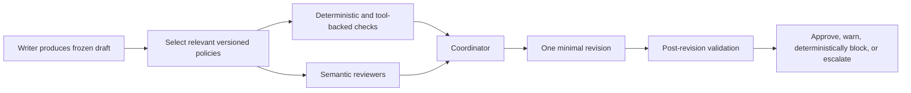

# Policy Review and Automatic Correction Proposal

Status: exploration proposal  
Recorded: 2026-07-30  
Scope: AI-generated natural-language and structured output  
Evidence baseline: Wisp experiments AI-02, AI-03, and AI-04 from 2026-07-28  
Strategic relationship: this proposal preserves decision-register item AI-14. AI-14 bans withholding a response because a semantic classifier considers it wrong; this proposal instead lets semantic findings become bounded revision instructions for the original writer before delivery.

## Executive view

The proposed product is a policy-aware review and repair layer between an AI writer and the user or downstream system. It would select the relevant policies, route each policy to the cheapest reliable validator, collect all findings against one immutable draft, consolidate the accepted findings into one revision plan, apply a minimal correction, and validate the result again.

The strongest part of the idea is not "one agent per rule." It is the coordinator and its ability to turn several independent, possibly conflicting findings into one controlled, explainable, and auditable patch.

The architecture is directionally consistent with the AI-02 to AI-04 experiments, especially their versioning, provenance, deterministic precedence, aggregation, exact binding, minimal repair, and revalidation principles. Those experiments did not, however, test semantic reviewers, reviewer accuracy, free-text correction, multi-model independence, or production cost and latency. This proposal therefore remains an exploration and benchmark target, not a validated security boundary.

## Product concept

A writer model produces an initial draft. Relevant deterministic validators, tool-backed checks, and semantic reviewers inspect the same frozen draft in parallel. They return structured findings rather than editing the draft themselves. A coordinator then:

- normalizes and deduplicates findings;
- rejects weak, irrelevant, or unsupported findings;
- applies policy priority and resolves conflicts;
- separates mandatory enforcement from advisory improvements;
- identifies content that must be preserved;
- creates one minimal revision plan; and
- records why each finding was accepted, rejected, merged, or escalated.

The writer or a constrained patcher applies the consolidated plan once. The revised result is then checked again before it is approved, returned with a warning, blocked by a deterministic rule, or escalated.



## Intended product boundary

The layer can review:

- customer-support and sales replies;
- structured model output before an API consumes it;
- agent plans and tool-call arguments before execution;
- organization-specific claims, disclosures, permissions, and tone; and
- other generated content for which the customer can supply testable policies.

It must not be presented as proof that an output is safe, lawful, true, or complete. Semantic reviewers remain probabilistic. Deterministic enforcement, authoritative external verification, and human approval remain separate trust boundaries.

## Hybrid checking architecture

### Deterministic validators

Use deterministic checks when the rule can be expressed and tested without model judgment:

- JSON shape, required fields, types, and character limits;
- numeric thresholds and authority limits;
- allowlists, blocklists, required phrases, and stable identifiers;
- URL, permission, scope, and tool-argument validation;
- known PII and secret patterns; and
- exact product, account, inventory, or entitlement checks through an authoritative service.

Deterministic failures can be mandatory and blocking when their semantics are established and their adapters are trusted.

### Tool-verified checks

Use authoritative tools when a claim depends on mutable external state, such as price, inventory, permissions, customer status, contractual authority, or an approved product capability. A reviewer must not substitute its own confidence for a failed or unavailable verification.

### Semantic reviewers

Use semantic reviewers for context-sensitive questions such as unsupported implications, misleading phrasing, tone, incomplete explanations, contradictory claims, brand requirements, and policy interpretation.

For Wisp's current strategy, semantic findings may be returned to the original writer as bounded revision instructions before delivery. This is a self-review and editing step, not a semantic hard-block boundary. A reviewer does not gain authority to suppress a response merely because it reports high confidence. If one revision does not resolve an uncertain finding, ordinary Wisp output should not enter an endless loop or be silently withheld; a consequential managed workflow may instead route the unresolved case to human review.

### Retrieval

Vector or lexical retrieval may select candidate policies, approved examples, prior decisions, and relevant source material. Retrieval never determines pass or fail. Policy status, version, scope, priority, and validator type determine authority.

## Proposed contracts

### Policy record

Every policy should be scoped, versioned, testable, and attributable.

```json
{
  "policy_id": "NO_REFUND_GUARANTEE",
  "version": 3,
  "scope": {"tenant": "example", "workflow": "support_reply"},
  "status": "active",
  "priority": 80,
  "severity": "critical",
  "enforcement": "deterministic_block",
  "validator": "refund_authority_check",
  "rule": "Do not guarantee a refund before approval.",
  "correction_guidance": "Describe the request as subject to review.",
  "source_ref": "policy://support/refunds#approval",
  "approved_by": "policy-owner-id",
  "tests": ["test-case-101", "test-case-102"]
}
```

The initial enforcement values should distinguish at least:

- `deterministic_block`;
- `deterministic_repair`;
- `semantic_review`;
- `warn`;
- `human_review`; and
- `disabled`.

### Reviewer finding

Reviewers must cite an exact output location and policy version. Free-form criticism without evidence is not an actionable finding.

```json
{
  "finding_id": "finding-42",
  "policy_id": "NO_REFUND_GUARANTEE",
  "policy_version": 3,
  "validator_id": "semantic-reviewer-support-1",
  "result": "fail",
  "severity": "critical",
  "location": {"field": "body", "start": 94, "end": 124},
  "affected_text_digest": "sha256:...",
  "explanation": "The wording promises an outcome that still requires approval.",
  "evidence": ["policy://support/refunds#approval"],
  "suggested_change": "Use conditional review language.",
  "confidence": 0.91
}
```

Confidence is metadata for routing and calibration, not permission to bypass policy or human review.

### Consolidated revision plan

```json
{
  "draft_digest": "sha256:...",
  "policy_snapshot_digest": "sha256:...",
  "decision": "revise",
  "mandatory_fixes": [],
  "advisory_fixes": [],
  "preserve": [],
  "rejected_findings": [],
  "conflicts": [],
  "escalations": [],
  "maximum_revision_cycles": 1
}
```

The plan binds the exact draft and policy snapshot. A changed draft or changed policy set makes the plan stale.

## Coordinator rules

The coordinator is a decision component, not a second unrestricted writer. It should follow these invariants:

1. A semantic reviewer cannot downgrade or remove a deterministic failure.
2. A lower-priority policy cannot override a higher-priority policy without an explicit precedence rule.
3. Conflicting mandatory findings are escalated unless a deterministic precedence rule resolves them.
4. Findings without a policy version, affected location, and evidence are rejected or treated as advisory.
5. The coordinator records rejected and merged findings; it does not silently discard them.
6. Required disclosures, verified facts, customer-provided facts, and protected spans are preserved unless a higher-priority policy explicitly requires a change.
7. Revision instructions describe the minimum necessary change and prohibit unsupported additions.
8. The coordinator cannot approve its own unresolved uncertainty on a critical policy.

One reviewer per rule should not be a fixed architecture requirement. Related rules may share a reviewer call when doing so reduces cost without losing per-rule results, independent evidence, or calibration. Routing should be measured, not assumed.

## Revision and revalidation

Structured output should be patched at the field level. Natural language should be edited by bounded spans or sentences where practical. Full regeneration is a fallback for changes that cannot be expressed safely as a local patch.

After revision:

- deterministic validators run again;
- all critical policies run again against the complete output;
- changed regions are rechecked for applicable non-critical policies;
- protected content and required disclosures are compared with the frozen original;
- the system detects unsupported facts introduced by the revision; and
- a stale draft or policy snapshot invalidates the revision result.

The initial system should allow one automatic revision cycle. If a mandatory failure remains, findings conflict, verification is unavailable, or the repair introduces a new critical issue, it should stop and escalate rather than enter an open-ended rewrite loop.

## Security and guardrail requirements

### Treat content as untrusted data

The user request, draft, retrieved examples, reviewer explanations, and policy documents can all contain prompt injection or malicious instructions. They must be passed as delimited data, not mixed into the coordinator's executable instructions. Retrieved text cannot grant tools, change policy priority, or alter the output schema.

### Use least privilege

Reviewers should have no write or execution tools by default. A tool-backed validator receives only the specific, typed lookup it needs. The writer receives the revision plan, protected spans, and required source facts, not raw credentials, unrelated reviewer context, or unrestricted policy-management access.

### Freeze and bind every decision

The original draft, applicable policy versions, tool results, findings, revision plan, and final output should be content-addressed. Revisions and approvals apply only to those exact snapshots. A policy edit invalidates pending findings and repair permissions.

### Separate detection from safe repair

A correct detection does not imply that the suggested correction is safe. A repair must be deterministic or independently checked for scope, preservation, unsupported additions, and all active policies before it can be applied automatically.

### Preserve privacy in the audit trail

Auditability does not require retaining every raw secret or PII value. Store the minimum necessary record, use redacted excerpts or content digests where possible, encrypt sensitive retained data, apply tenant-specific retention, and record access to audit material.

### Bound cost and denial-of-service risk

Set limits for selected policies, reviewer calls, retrieved context, output size, time, and revision cycles. Fail safely when the budget is exhausted: preserve deterministic blocks, mark incomplete semantic coverage, and route according to workflow risk.

### Do not rely on model diversity as proof of independence

Different prompts or providers may still produce correlated errors. Independence must be measured against independently labelled data. Deterministic evidence and authoritative tools carry more weight than reviewer voting.

## Relationship to the July 28 experiments

| Prior work | What it supports here | What it did not test |
|---|---|---|
| AI-02: typed, revisioned project state | Versioned policies, provenance, scoped authority, immutable history, stale-write conflict detection, and exact confirmation before materialization | Policy compilation, semantic review, output correction, reviewer calibration, or audit retention policy |
| AI-03: composed executable guards | Deterministic-first enforcement, explicit precedence, trusted typed action envelopes, fail-closed incomplete parsing, shadow mode, and version-bound exact exceptions | Natural-language claims, semantic policy interpretation, reviewer coordination, or revised-output validation |
| AI-04: guard decision flow | Aggregate multiple findings before acting, separate match confidence from repair eligibility, keep uncertain matches advisory, bind decisions to guard versions, and re-evaluate repaired actions against all active guards | A rendered UI, human usability, multi-process concurrency, semantic rewriting, conflicting natural-language recommendations, or real-world false-positive rates |

The proposal is therefore an extension of the same safety philosophy, not a result already demonstrated by those experiments.

## Where the proposal agrees with prior evidence

- Review all applicable rules before applying one change. AI-04 showed the value of aggregating multiple guard triggers into one decision instead of prompting or mutating sequentially.
- Revalidate after repair. AI-04 established that a suggested repair can create another violation and must be evaluated against all active guards.
- Use deterministic mechanisms wherever possible. AI-03's strongest evidence came from explicit normalization, precedence, path invariants, and exact action binding, not model judgment.
- Version policies and invalidate stale decisions. AI-02 and AI-04 both support immutable history and version-bound actions.
- Keep retrieval separate from authority. AI-02 distinguished relevance-oriented memory from authoritative project state; the same distinction applies to policy retrieval.
- Prefer a minimal, inspectable change. AI-02's exact preview and AI-04's repair preview both support a controlled-patch approach.
- Start in shadow mode. AI-03 explicitly recommends independently labelled replay before broad enforcement.

## Where the proposal goes beyond prior evidence

1. **Bounded semantic revision is distinct from semantic hard blocking.** AI-14 prohibits withholding a response because a probabilistic semantic checker objects. This proposal is compatible when the checker gives a consolidated plan back to the original writer for one controlled revision and does not independently veto the final response. Deterministic failures may still block, while consequential workflows may separately require human approval.
2. **Automatic free-text correction is untested.** AI-04 tested deterministic action repair in a simulation, not a writer editing claims while preserving meaning and disclosures.
3. **Reviewer consensus is not correctness.** The experiments used authored deterministic expectations. They do not support majority voting, one-reviewer-per-rule accuracy claims, or confidence thresholds for semantic enforcement.
4. **The coordinator is a new critical component.** AI-04 aggregated known guard matches, but it did not adjudicate ambiguous evidence or competing natural-language instructions.
5. **The proposed enterprise audit record creates privacy obligations.** Earlier experiments emphasized local isolation but did not test retention, redaction, tenant separation, or access control for customer content.
6. **Cost and latency claims remain hypothetical.** Parallel calls reduce wall-clock time only when provider limits, retrieval, coordinator work, and the second validation pass do not dominate.
7. **Provider mixing is a mitigation, not a guarantee.** No experiment measured correlated writer-reviewer failures across model families.

## Recommended initial experiment

Run a narrow, offline benchmark for customer-support replies before connecting the system to production traffic.

### Scope

- one workflow, such as refund and delivery replies;
- 10-20 versioned policies;
- a mix of deterministic, tool-verified, semantic, and human-only rules;
- independently labelled passing, failing, ambiguous, adversarial, and multi-policy examples;
- prompt-injection content inside user text, retrieved documents, and model drafts; and
- no production blocking or customer-visible automatic sending.

### Systems to compare

1. one general-purpose LLM judge;
2. grouped parallel reviewers without a coordinator;
3. grouped parallel reviewers with a coordinator;
4. sequential review-and-rewrite;
5. deterministic and tool-backed checks only; and
6. the hybrid coordinator plus one bounded revision and recheck.

### Measurements

- per-policy violation recall and false-positive rate;
- deterministic versus semantic error rates reported separately;
- coordinator acceptance and rejection accuracy;
- conflict-resolution accuracy;
- correction success and new-violation rate;
- protected-content loss and unsupported-fact introduction;
- average changed characters or fields;
- human override and escalation rates;
- policy-selection recall;
- latency by stage and cost per checked output; and
- failure behavior under stale policies, unavailable tools, malformed reviewer output, and exhausted budgets.

Targets should be preregistered from the consequence of each rule, not chosen after observing the benchmark. The semantic revision loop should remain offline or shadow-evaluated until it is tested on independently labelled examples and reviewed by the policy owner.

## Product recommendation

Proceed with the idea as a measured review-and-repair experiment, not yet as a security guarantee or a broad Wisp feature.

The most promising initial product is a hybrid policy compiler and correction coordinator for one high-volume workflow. The safest initial architecture is deterministic-first, tool-verified where facts are mutable, bounded semantic revision by the original writer, minimal-diff editing, full revalidation, version binding, and human escalation for consequential uncertainty.

The first question to prove is not whether many reviewer agents can find issues. It is whether the coordinator produces smaller, more correct, more policy-compliant revisions than a single judge or sequential review, without increasing false positives, new violations, cost, or user confusion.
